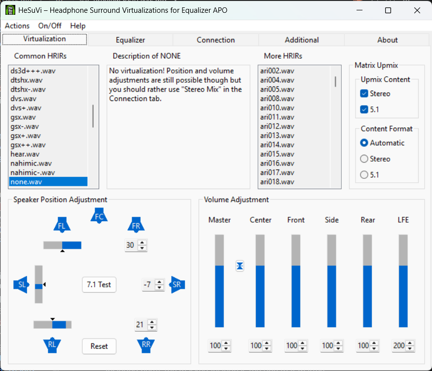
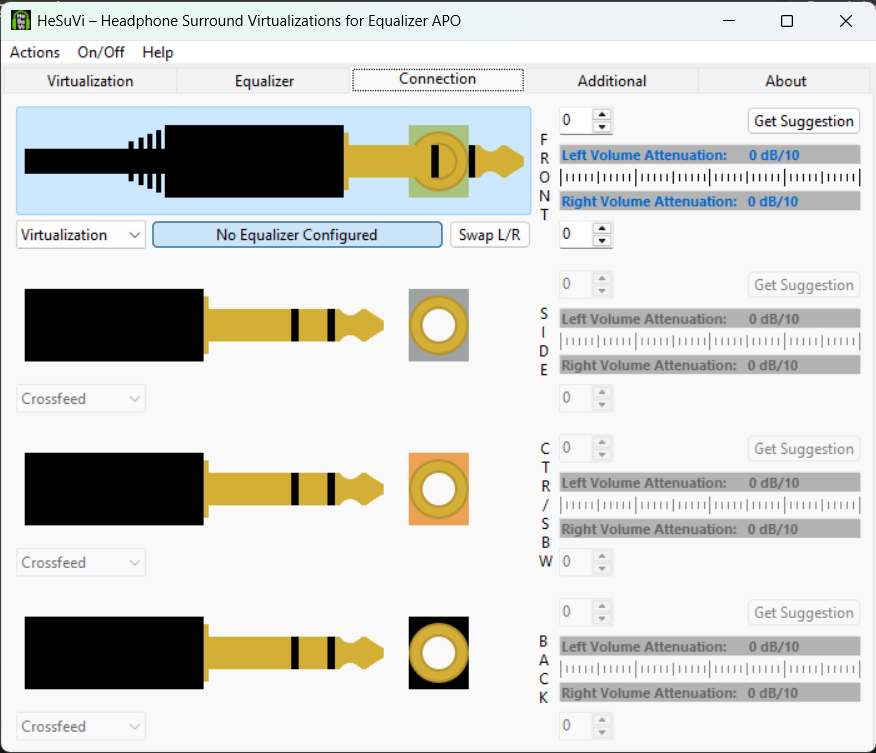
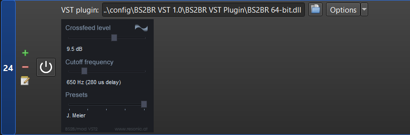
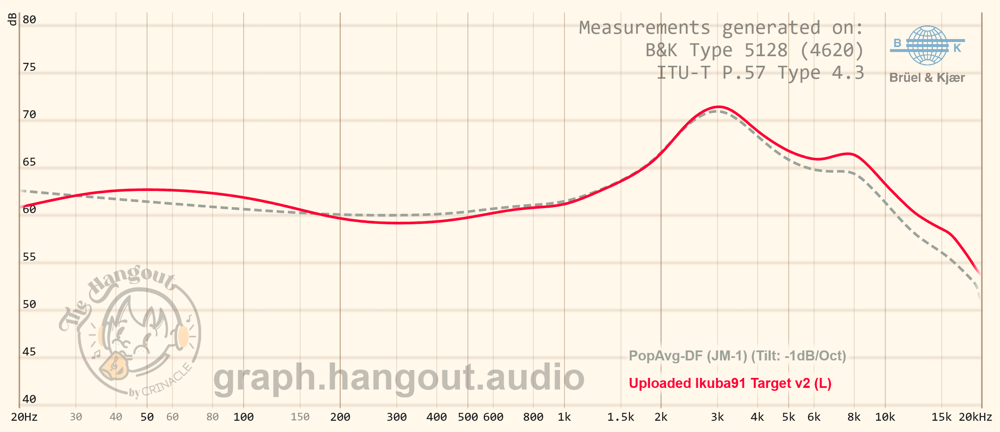

# Equalizer APO config — transparent "virtualization", punchy bass, masked BS2B crossfeed, IEM EQ

Documentation of my [Equalizer APO](https://sourceforge.net/projects/equalizerapo/) setup, with the shared config pieces included. The chain in [config.txt](config.txt) runs in this order:

```
Preamp -5 dB
├─ mask-pre.txt        bass-bypass: grab clean stereo bass BEFORE HeSuVi
├─ HeSuVi\hesuvi.txt   HeSuVi (none.wav — see why below)
├─ mask-post.txt       bass-bypass: strip virtualized bass, add the clean bass back
├─ Crossfeed\          BS2B crossfeed, masked to below 400 Hz
└─ device EQ           frequency correction per IEM/headphone
```

HeSuVi and the BS2BR VST are **not** included in this repo — download them (links below) and drop them next to these files.

## 1. HeSuVi — `none.wav` on purpose

Download [HeSuVi](https://sourceforge.net/projects/hesuvi/) into `config\HeSuVi` as usual, then set it up like this:

- **Virtualization tab:** select `none.wav` under Common HRIRs
- **Matrix Upmix:** Stereo ✔ and 5.1 ✔, Content Format: Automatic
- **Speaker Position Adjustment:** front `30`, side `-7`, rear `21`
- **Volume Adjustment:** everything `100`, LFE `200`
- **Connection tab:** your output device on **Virtualization**




Why `none.wav` instead of a real HRIR: `none.wav` is a dirac delta (ipsi = 1.0, contra = 0.0, center = 0.5), so the convolution stage adds **no HRTF coloration and no time smearing** — you keep the full, clearer resolution of the raw signal. But HeSuVi's matrix upmix + speaker-position mixdown still runs, and with the settings above it is *not* a pass-through. Working the actual coefficients through `matrix.txt` → `move.txt` → `mix.txt`, the output comes to:

```
L_out ≈ 1.17·L − 0.17·R      R_out ≈ 1.17·R − 0.17·L
```

That means **mono/center content passes at exactly 1.0×** while **side/ambience (L−R) content is lifted ~+2.5 dB**. Low-level spatial cues — room tails, reverb, hard-panned micro detail — sit in that difference signal, so they become more audible. You get the "virtualization buff" of micro detail being more heard, without paying the resolution cost of a real HRIR.

## 2. Bass-bypass mask — keep the bass punchy

Even with the transparent setup above, letting bass run through the upmix/mixdown widens and softens it. The mask keeps low-end punch:

- [mask-pre.txt](mask-pre.txt) — before HeSuVi, copies the clean stereo bass into spare channels through an LR4 low-pass
- [mask-post.txt](mask-post.txt) — after HeSuVi, LR4 high-passes the processed signal and adds the untouched dry bass back
- [mask-switch.txt](mask-switch.txt) — the switch and settings: `mask=true/false`, crossover `xover=150` Hz, `bassgain`, `bassdelay`

The LR4 low-pass + LR4 high-pass sum flat, so the crossover is seamless. Result: everything above 150 Hz gets the ambience lift, while the bass stays dry, tight, and punchy.

## 3. Crossfeed — BS2B on Jan Meier, masked to <400 Hz

Download the **BS2BR VST** (BS2B/mod VST2 by Resonic, [resonic.at](https://www.resonic.at/)) into `config\BS2BR VST 1.0`.

Set the plugin to the **Jan Meier** preset — crossfeed level 9.5 dB, cutoff 650 Hz. That is exactly what the saved parameters in the configs encode (`Feed 0.607143` = 9.5 dB, `FCut 0.205882` = 650 Hz).



But BS2B's internal crossfeed corner is fixed by the preset and can't be moved lower, so [Crossfeed\plugin-crossfed-masked.txt](Crossfeed/plugin-crossfed-masked.txt) masks the plugin instead of using it full-range: the signal is split with LR4 pairs at `cfx` Hz, only the lows go through BS2B, and the highs bypass completely untouched. Both LR4 splits sum flat and BS2B adds no latency, so the recombine is seamless. This gives **manual control of the crossfeed cutoff** rather than the non-configurable built-in corner.

Default is `Eval: cfx=400` — my preference. Edit that one line to taste.

[Crossfeed\Crossfeed.txt](Crossfeed/Crossfeed.txt) is the selector — in my local setup it can also switch to the unmasked plugin or experimental DIY crossfeeds (not included here); the masked include is the one that matters.

## 4. EQ — frequency correction

In my local setup each IEM/headphone has its own profile folder (`Hidizs MP145\`, `Tanchjim 4U\`, …) and [config.txt](config.txt) includes the active one — those profiles are personal, so they're not in this repo. Swap the `Include: Hidizs MP145\Hidizs MP145.txt` line in `config.txt` for your own EQ file.

For IEMs I EQ to my own target: **[Ikuba91 Target v2.txt](Ikuba91%20Target%20v2.txt)**.

> ⚠️ The target is for **B&K 5128 measurements specifically from hangout — https://graph.hangout.audio/iem/5128/** — only. Do not use it against 711-coupler or other rigs' measurements.

If your IEM is only measured on another rig/reviewer's database: AutoEQ it to **JM-1 with −1 dB/oct tilt** instead, then include [JM-1 Tilt -1dB to Ikuba91 Target v2 - 1k.txt](JM-1%20Tilt%20-1dB%20to%20Ikuba91%20Target%20v2%20-%201k.txt) on top — it's the correction layer that maps JM-1 −1 dB tilt onto my target.

Both curves in one graph — normalized at 1 kHz. The two differ only below ~700 Hz, which is exactly why the bridge file only needs three low-frequency filters (and why it translates safely across measurement rigs):



## Install

1. Install [Equalizer APO](https://sourceforge.net/projects/equalizerapo/)
2. Copy this repo's contents into `C:\Program Files\EqualizerAPO\config`
3. Download HeSuVi and the BS2BR VST into their folders as above
4. Set HeSuVi's settings as in section 1
5. Replace the device EQ include in `config.txt` with your own headphone/IEM correction
