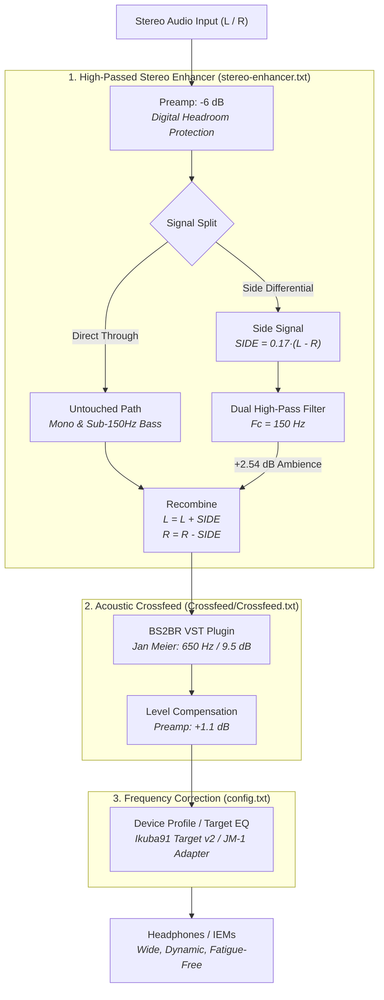
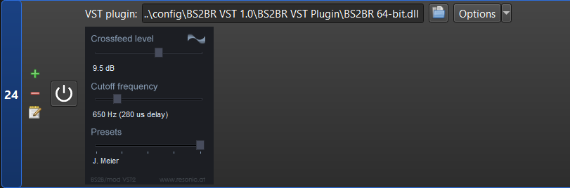
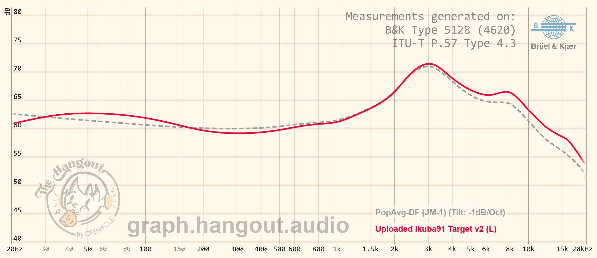

# Equalizer APO Config — High-Passed Stereo Enhancer, BS2B Crossfeed & IEM Target EQ

A streamlined, high-fidelity [Equalizer APO](https://sourceforge.net/projects/equalizerapo/) configuration providing wide spatial ambience, dynamic bass punch, fatigue-free VST crossfeed, and IEM frequency response correction.

---

## Signal Processing Pipeline


```mermaid
flowchart TD
    In["Stereo Audio Input (L / R)"] --> Pre["Preamp: -6 dB<br/><i>Digital Headroom Protection</i>"]

    subgraph Enhancer ["1. High-Passed Stereo Enhancer (stereo-enhancer.txt)"]
        Pre --> Split{"Signal Split"}
        Split -->|"Direct Through"| Direct["Untouched Path<br/><i>Mono & Sub-150Hz Bass</i>"]
        Split -->|"Side Differential"| Side["Side Signal<br/><i>SIDE = 0.17·(L - R)</i>"]
        Side --> HPF["Dual High-Pass Filter<br/><i>Fc = 150 Hz</i>"]
        Direct --> Sum["Recombine<br/><i>L = L + SIDE<br/>R = R - SIDE</i>"]
        HPF -->|"+2.54 dB Ambience"| Sum
    end

    subgraph XFeed ["2. Acoustic Crossfeed (Crossfeed/Crossfeed.txt)"]
        Sum --> VST["BS2BR VST Plugin<br/><i>Jan Meier: 650 Hz / 9.5 dB</i>"]
        VST --> Gain["Level Compensation<br/><i>Preamp: +1.1 dB</i>"]
    end

    subgraph TargetEQ ["3. Frequency Correction (config.txt)"]
        Gain --> IEM["Device Profile / Target EQ<br/><i>Ikuba91 Target v2 / JM-1 Adapter</i>"]
    end

    TargetEQ --> Out["Headphones / IEMs<br/><i>Wide, Dynamic, Fatigue-Free</i>"]
```

---

## 1. High-Passed Stereo Enhancer (`stereo-enhancer.txt`)

Standard full-range stereo widening diffuses low frequencies, causing mono kick drums and basslines to lose impact. [stereo-enhancer.txt](stereo-enhancer.txt) solves this with a **frequency-selective Mid/Side differential boost**:

$$L_{out} = L + 0.17 \cdot \text{HP}_{150}(L - R)$$
$$R_{out} = R - 0.17 \cdot \text{HP}_{150}(L - R)$$

- **Center & Mono ($L = R$)**: When content is centered (vocals, lead instruments), $(L - R) = 0$. Mono content passes with **bit-perfect unity gain ($0\text{ dB}$), zero latency, and zero phase rotation**.
- **Bass Below 150 Hz ($f < 150\text{ Hz}$)**: The high-pass filter rolls off the side boost in the low end. Sub-bass and mid-bass pass as direct, untouched stereo on the through path with dynamic punch intact.
- **Ambience & Micro-Details Above 150 Hz ($f > 150\text{ Hz}$)**: Stereo differential cues, room reverb tails, and panned instruments receive a transparent **$+2.54\text{ dB}$ widening lift**.

---

## 2. Acoustic Crossfeed (`Crossfeed/`)

Headphones provide 100% channel isolation between ears, which creates an unnatural "in-head" sensation and causes listening fatigue on hard-panned stereo recordings. Crossfeed simulates natural stereo loudspeaker listening by introducing head-shadowing attenuation and interaural time delay.

In [Crossfeed\Crossfeed.txt](Crossfeed/Crossfeed.txt):
- **Active ([Crossfeed/plugin-crossfed.txt](Crossfeed/plugin-crossfed.txt))**: The 64-bit **BS2BR VST** plugin set to the **Jan Meier preset** (`Feed 0.607143` = 9.5 dB, `FCut 0.205882` = 650 Hz / 280 $\mu$s delay) with $+1.1\text{ dB}$ unity gain compensation.
- **Backup ([Crossfeed/experimental-crossfeed-2.txt](Crossfeed/experimental-crossfeed-2.txt))**: Native low-band crossfeed (<400 Hz) using LR4 biquad pairs and cross-channel summing.



---

## 3. Safe Gain Staging & Headroom

In [config.txt](config.txt), the global preamp is set to:

```text
Preamp: -6 dB
```

This $-6\text{ dB}$ attenuation provides safe headroom so that the $+2.54\text{ dB}$ side boost, crossfeed summing ($+1.5\text{ dB}$), and your downstream IEM EQ filters do not cause inter-sample clipping on full-scale digital peaks.

---

## 4. IEM Target EQ & JM-1 Adapters

### Target Curve: `Ikuba91 Target v2.txt`
- Measured on Brüel & Kjær Type 5128 (ITU-T P.57 Type 4.3).
- Clean sub-bass roll-off (<35 Hz) to eliminate muddy rumble, punchy mid-bass bump (50–80 Hz), lower-mid scoop (300 Hz) for separation, standard diffuse-field compliant 3 kHz ear gain, and extended upper treble sparkle (7–15 kHz).

### JM-1 Tilt Adapters
If your IEM was AutoEQ'd on another database to **PopAvg-DF (JM-1) with -1 dB/octave tilt**:
- **[JM-1 Tilt -1dB to Ikuba91 Target v2 - 1k.txt](JM-1%20Tilt%20-1dB%20to%20Ikuba91%20Target%20v2%20-%201k.txt)**: Adapts the low end (<1 kHz) while leaving treble untouched to avoid cross-coupler resonance variations.
- **[JM-1 Tilt -1dB to Ikuba91 Target v2 - Full.txt](JM-1%20Tilt%20-1dB%20to%20Ikuba91%20Target%20v2%20-%20Full.txt)**: Full-spectrum adapter including the $+2.3\text{ dB}$ peak at 7.8 kHz and $+2.0\text{ dB}$ air shelf at 14 kHz.



---

## 5. Directory Contents

```text
config.txt                                      Main Equalizer APO configuration
stereo-enhancer.txt                             High-Passed Mid/Side stereo enhancer
Crossfeed/
  Crossfeed.txt                                 Crossfeed selector
  plugin-crossfed.txt                           BS2BR VST plugin (Jan Meier preset: 650 Hz / 9.5 dB)
  plugin-crossfed-masked.txt                    BS2BR VST plugin masked below 400 Hz
  experimental-crossfeed-2.txt                  Backup native crossfeed (<400 Hz)
Ikuba91 Target v2.txt                           B&K 5128 IEM target curve
JM-1 Tilt -1dB to Ikuba91 Target v2 - 1k.txt    Bass/lower-mid translation adapter (<1 kHz)
JM-1 Tilt -1dB to Ikuba91 Target v2 - Full.txt  Full-spectrum translation adapter
```
